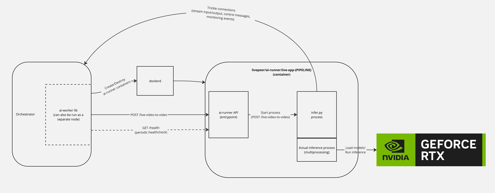

# Realtime AI Inference Runtime Overview

## Introduction

The architecture consists of several key components:

- **`ai-worker` library**: Embedded in `go-livepeer`, it can be run by the Orchestrator or as a separate Worker node.
- **`ai-runner` container**: This container includes:
  - **Runner API**: The entry point for the container, which interacts with the `ai-worker` library. It starts the `infer.py` process when the `/live-video-to-video` API is called.
  - **`infer.py` process**: Manages the inference runtime and monitoring. It initiates a separate "Pipeline Process" using Python's `multiprocessing` library to handle the actual inference.

[Miro Board](https://miro.com/app/board/uXjVL0AgKN0=/?share_link_id=516154359809)

## Startup flow

The high level description of how the above components interact is:
- When the worker gets a request to start some live inference, the worker will start a new `ai-runner` container in the host. The exact image changes depending on the pipeline, and in case of the `live-video-to-video` pipeline also on the `model_id` (which is called the "live pipeline"). Here we will focus on the live pipelines.
- After starting the container, the worker will then call the `POST /live-video-to-video` API to send the parameters for the inference.
- The runner API, which is the entrypoint of the container, will then start a new sub-process which is the `infer.py` (lives under the `live/` folder in the app code)
- This `infer.py` is the one that will actually handle the bulk of the inference runtime logic.
- It connects to the trickle server endpoints (which are served by the Orchestrator itself, which may be remote)
- It starts the Pipeline Process to handle the actual inference using the `multiprocessing` library.
- It runs a couple of tasks to manage the communication between the trickle streams and this inference process. It also starts some other tasks to handle updating the parameters of the inference ("Control API"), as well as monitoring the state of this sub-process and sending metrics about it.
- This inference (sub-)sub-process uses the cheapest possible communication with the outside world, so it can have the most Python-interpreter-resources dedicated to the inference logic itself. This communication is made using the native `multiprocessing.Queue`s that uses the OS IPC mechanism.

## Inference flow
- Segments stream from the Gateway to the Runner through the Orchestrator via a Trickle stream. This is made in a low latency way since the Runner can start getting the segment data before the full segment is sent to the O (Trickle magic).
- The `infer.py` process also runs an `ffmpeg` process to decode those segments into individual frames
- These individual frames are then sent on an input `multiprocessing.Queue` which is picked up by the Pipeline Process
- Pipeline Process runs the inference and returns another frame
- The output frame is sent on an output `multiprocessing.Queue` which is picked up by the `infer.py` process
- The output frames are then muxed back into segments by another `ffmpeg` pipe
- These output segments are sent back to the Gateway through the Orchestrator via another Trickle streams.
- There are also additional trickle streams and queues for control messages and monitoring events.

## Monitoring flow

- The worker will also start a routine to watch the runner container when it is started.
- That routine will call the `/health` endpoint periodically (5s as of writing this)
- Runner API handles that endpoint and forwards to the pipeline, which defaults to returning an `OK`
- In the `live-video-to-video` pipeline, there is a custom logic instead that proxies the call to the `infer.py` process (in case it is running)
- So the live pipeline runner health is:
  - `IDLE` if no process is running
  - `ERROR` if it's running but state is `OFFLINE` (no input frames for 60s), or
  - `OK` otherwise
- On the worker watch container logic:
  - If the runner is OK, keep health checking
  - If the runner is IDLE, return the container to the resource pool so another stream can use it
  - If the runner is ERROR (or there's any other error calling `/health`), kill the container after 2 errors (after a 60s startup grace period)
- The `infer.py` process will automatically kill itself when the input stream stops, so the happy path is that the input ends, the `infer.py` kills itself which makes the container available (`IDLE`) to be used for other streams.
- Any other non-happy scenario should be ideally covered by the whole healthchecking logic, including if the container or any of the processes become unresponsive (either the state will become `OFFLINE` or the healthcheck will fail which is also considered an error).
