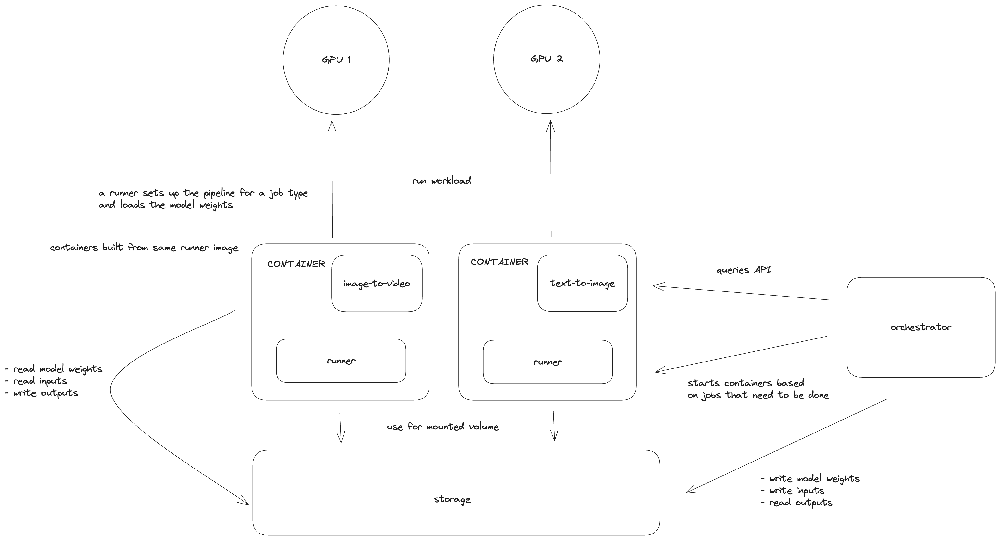

# How to run
docker build --no-cache -t livepeer/ai-runner:base .
docker build --no-cache -t livepeer/ai-runner:multimedia -f docker/Dockerfile.multimedia .
docker build --no-cache -t livepeer/ai-runner:stream-diffusion -f docker/Dockerfile.stream-diffusion .
docker build --no-cache -t livepeer/ai-runner:apps -f docker/Dockerfile.apps .
docker run -d --add-host=host.docker.internal:host-gateway --gpus all -p 10420:8080 --name realtime -v ~/ai-worker/runner/app:/app -v /tmp/video:/tmp/video livepeer/ai-runner:apps
docker exec -it realtime /bin/bash


# Runner

The AI runner is a containerized Python application responsible for processes AI inference requests on the [Livepeer AI subnet](https://explorer.livepeer.org/treasury/82843445347363563575858115586375001878287509193479217286690041153234635982713). It loads models into GPU memory and exposes a REST API other programs like the [AI worker](../README.md) can use to request AI inference requests.

## Architecture

A high level sketch of how the runner is used:



The AI runner, found in the [app](./app) directory, consists of:

- **Routes**: FastAPI routes in [app/routes](./app/routes) that handle requests and delegate them to the appropriate pipeline.
- **Pipelines**: Modules in [app/pipelines](./app/pipelines) that manage model loading, request processing, and response generation for specific AI tasks.

It also includes utility scripts:

- **[bench.py](./bench.py)**: Benchmarks the runner's performance.
- **[gen_openapi.py](./gen_openapi.py)**: Generates the OpenAPI specification for the runner's API endpoints.
- **[dl_checkpoints.sh](./dl_checkpoints.sh)**: Downloads model checkpoints from Hugging Face.
- **[modal_app.py](./modal_app.py)**: Deploys the runner on [Modal](https://modal.com/), a serverless GPU platform.

## Running with Docker

### Get the Docker Image

Ensure [Docker](https://docs.docker.com/engine/install/ubuntu/) and the [nvidia-container-toolkit](https://docs.nvidia.com/datacenter/cloud-native/container-toolkit/latest/install-guide.html) are installed, with Docker correctly [configured](https://docs.nvidia.com/datacenter/cloud-native/container-toolkit/latest/install-guide.html#configuring-docker). Then, either pull the pre-built image from DockerHub or build the image locally in this directory.

#### Pull Docker image

```bash
docker pull livepeer/ai-runner:latest
```

#### Build Docker image

```bash
docker build -t livepeer/ai-runner:latest .
```

### Download AI Models

The AI Runner container's runner app uses [HuggingFace](https://huggingface.co/) model IDs to reference models. It expects model checkpoints in a `/models` directory, which can be mounted to a local `models` directory. To download model checkpoints to the local `models` directory, use the `dl-checkpoints.sh` script:

1. **Install Hugging Face CLI**: Install the Hugging Face CLI by running the following command:

   ```bash
   pip install huggingface_hub[cli,hf_transfer]
   ```

2. **Set up Hugging Face Access Token**: Generate a Hugging Face access token as per the [official guide](https://huggingface.co/docs/hub/en/security-tokens) and assign it to the `HG_TOKEN` environment variable. This token enables downloading of [private models](https://huggingface.co/docs/transformers.js/en/guides/private) from the Hugging Face model hub. Alternatively, use the Hugging Face CLI's [login command](https://huggingface.co/docs/huggingface_hub/en/guides/cli#huggingface-cli-login) to install the token.

   > [!IMPORTANT]
   > The `ld_checkpoints.sh` script includes the [SVD1.1](https://huggingface.co/stabilityai/stable-video-diffusion-img2vid-xt-1-1) model. To use this model on the _AI Subnet_, visit its [page](https://huggingface.co/stabilityai/stable-video-diffusion-img2vid-xt-1-1), log in, and accept the terms.

3. **Download AI Models**: Use the [ld_checkpoints.sh](https://github.com/livepeer/ai-worker/blob/main/runner/dl_checkpoints.sh) script to download models from `aiModels.json` to `~/.lpData/models`. Run the following command in the `.lpData` directory:

   ```bash
   curl -s https://raw.githubusercontent.com/livepeer/ai-worker/main/runner/dl_checkpoints.sh | bash -s -- --beta
   ```

   > [!NOTE]
   > The `--beta` flag downloads only models supported by the Livepeer.inc Gateway node on the _AI Subnet_. Remove this flag to download all models.

> [!TIP]
> If you want to download individual models you can checkout the `dl-checkpoints.sh` script to see how to download model checkpoints to the local `models` directory.

### Run the Pipelines

#### Run text-to-image container

Run container:

```bah
docker run --name text-to-image -e PIPELINE=text-to-image -e MODEL_ID=<MODEL_ID> --gpus <GPU_IDS> -p 8000:8000 -v ./models:/models livepeer/ai-runner:latest
```

Query API:

```bash
curl -X POST -H "Content-Type: application/json" localhost:8000/text-to-image -d '{"prompt":"a mountain lion"}'
```

Retrieve the image from the response:

```bash
curl -O 0.0.0.0:8937/stream/<STREAM_URL>.png
```

#### Run image-to-image container

Run container:

```bash
docker run --name image-to-image -e PIPELINE=image-to-image -e MODEL_ID=<MODEL_ID> --gpus <GPU_IDS> -p 8000:8000 -v ./models:/models livepeer/ai-runner:latest
```

Query API:

```bash
curl -X POST localhost:8000/image-to-image -F prompt="a mountain lion" -F image=@<IMAGE_FILE>
```

Retrieve the image from the response:

```bash
curl -O 0.0.0.0:8937/stream/<STREAM_URL>.png
```

#### Run image-to-video container

Run container

```bah
docker run --name image-to-video -e PIPELINE=image-to-video -e MODEL_ID=<MODEL_ID> --gpus <GPU_IDS> -p 8000:8000 -v ./models:/models livepeer/ai-runner:latest
```

Query API:

```bash
curl -X POST localhost:8000/image-to-video -F image=@<IMAGE_FILE>
```

Retrieve the image from the response:

```bash
curl -O 0.0.0.0:8937/stream/<STREAM_URL>.mp4
```

### Test with Swagger UI


The runner comes with a built-in [Swagger UI](https://fastapi.tiangolo.com/features/) for testing API endpoints. Visit `http://localhost:8000/docs` to access it.

### Apply Pipeline Optimizations

The runner contains several optimizations to speed up inference or reduce memory usage:

- `SFAST`: Enables the [stable-fast](https://github.com/chengzeyi/stable-fast) optimization, enhancing inference performance.

### Run benchmarking Script

```bash
docker run --gpus <GPU_IDs> -v ./models:/models livepeer/ai-runner:latest python bench.py --pipeline <PIPELINE> --model_id <MODEL_ID> --runs <RUNS> --batch_size <BATCH_SIZE>
```

Example command:

```bash
# Benchmark the text-to-image pipeline with the stabilityai/sd-turbo model over 3 runs using GPU 0
docker run --gpus 0 -v ./models:/models livepeer/ai-runner:latest python bench.py --pipeline text-to-image --model_id stabilityai/sd-turbo --runs 3
```

Example output:

```bash
----AGGREGATE METRICS----


pipeline load time: 1.473s
pipeline load max GPU memory allocated: 2.421GiB
pipeline load max GPU memory reserved: 2.488GiB
avg inference time: 0.482s
avg inference time per output: 0.482s
avg inference max GPU memory allocated: 3.024s
avg inference max GPU memory reserved: 3.623s
```

For benchmarking script usage information:

```bash
docker run livepeer/ai-runner:latest python bench.py -h
```

### Deploy on Modal

To deploy the runner on [Modal](https://modal.com/), a serverless GPU platform, follow these steps:

1. **Prepare for Deployment**: Use the `modal_app.py` file for deployment. Before you start, perform a dry-run in a dev [environment](https://modal.com/docs/reference/cli/environment) to ensure everything is set up correctly.

2. **Create Secrets**: In the Modal dashboard, create an `api-auth-token` [secret](https://modal.com/docs/guide/secrets#secrets) and assign the `AUTH_TOKEN` variable to it. This secret is necessary for authentication. If you're using gated HuggingFace models, create a `huggingface` secret and set the `HF_TOKEN` variable to your HuggingFace access token.

3. **Create a Volume**: Run `modal volume create models` to create a network [volume](https://modal.com/docs/guide/volumes#volumes). This volume will store the weights of your models.

4. **Download Models**: For each model ID referenced in `modal_app.py`, run `modal run modal_app.py::download_model --model-id <MODEL_ID>` to download the model.

5. **Deploy the Apps**: Finally, deploy the apps with `modal deploy modal_app.py`. After deployment, the web endpoints of your apps will be visible in your Modal dashboard.

## OpenAPI Specification

Regenerate the OpenAPI specification for the AI runner's API endpoints with:

```bash
python gen_openapi.py
```

This creates `openapi.json`. For a YAML version, use:

```bash
python gen_openapi.py --type yaml
```

## Development documentation

For more information on developing and debugging the AI runner, see the [development documentation](./dev/README.md).

## Credits

Based off of [this repo](https://github.com/huggingface/api-inference-community/tree/main/docker_images/diffusers).
